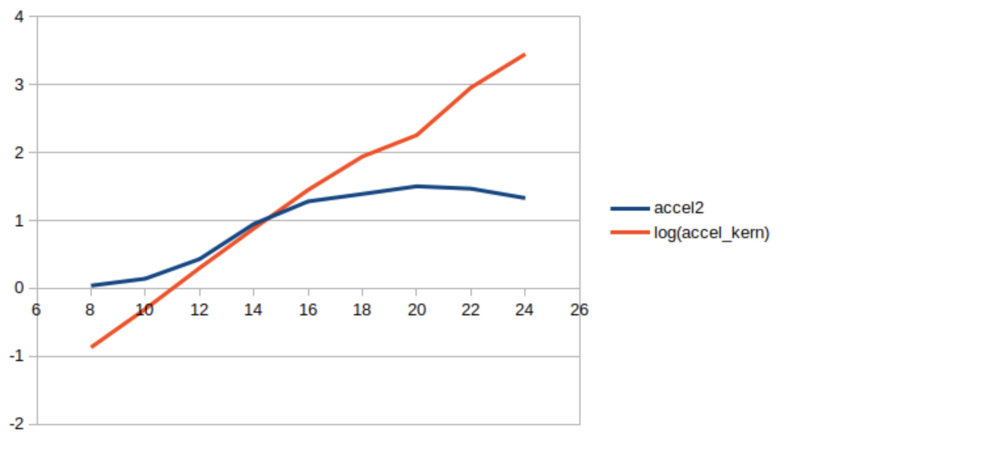

# TP3 Parallel Programming

### Notes

Since I am taking up this late, the numbers and results cannot come from my own experiments. They are thus taken from a friend. The report I am writing, and the codes I wrote with Younes on the date of the TP.

#### Configuration

CPU :

- Intel(R) Core(TM) i7-6700HQ CPU @ 2.60GHz
- 8 Cores

GPU :

- Nvidia Geforce GTX 970M
- 1280 Cuda Cores
- GPU Clock 924MHz + Boost
Memory : 3024MiB GDDR5, 2500 MHz


For this TP, an Nvidia GPU is necessary, as well as a recent GCC compiler version, with the latest OpenMP instructions.
`nvidia-cuda-toolkit`  Linux package is mandatory, in order to get Cuda.

In this TP, we are doing image treatments on GPU with CUDA. To do so, the files need a change of extension, from `.cpp` to `.cu` .
We also need the following headers;
```
#include "cuda_runtime.h"
#include "cuda.h"
#include "device_launch_parameters.h"
```

To invoke CUDA, we need to use a function declared this way:
`__global__ void kernel(args){}`

And here is a list of variables we need to familiarize with:

`__shared__ type variable[size]` : Declaration of an array in GPU shared memory
`blockIdx, blockDim, threadIdx` : Variables letting the kernel have positional informations from the GPU
`atomidAdd(&acc, val)` : Adds `val` to `acc` in a thread safe atomic way
`__syncthreads()` : Function to synchronize the threads of a block.

Each block contains a certain amount of threads, and arguments are passed to the kernel like this:
```
dim3 blocks(args); // ex: block(10,10)
dim3 threads(args2); // threads(32,32)
kernel<<<blocks,threads>>>(args);
```

We need to allocate the GPU memory ourselves. With a `malloc`, `copy`, `operation`, `free` cycle.


## Two Vectors Scalar Product

Here we need to multiply element by element and then sum. In Cuda, we use a thread partial variable and do an `atomicAdd` to compute the total in a thread safe manner


#### Cuda code

```
__global__ void gpu_func(int n, float *x, float *y, float *s)
{
  int i = blockIdx.x*blockDim.x + threadIdx.x;
  if (i < n) atomicAdd(s, x[i] * y[i]);
}
```

```
cudaMalloc(&d_x, N*sizeof(float)); 
cudaMalloc(&d_y, N*sizeof(float));
cudaMalloc(&d_s, sizeof(float));
cudaMemcpy(d_x, x, N*sizeof(float), cudaMemcpyHostToDevice);
cudaMemcpy(d_y, y, N*sizeof(float), cudaMemcpyHostToDevice);
cudaMemcpy(d_s, &s_gpu, sizeof(float), cudaMemcpyHostToDevice);

s_gpu = 0;
cudaMemcpy(d_s, &s_gpu, sizeof(float), cudaMemcpyHostToDevice);
t0 = std::chrono::high_resolution_clock::now();
gpu_func<<<(N+k)/k, k>>>(N, d_x, d_y, d_s);
cudaDeviceSynchronize();
cudaMemcpy(&s_gpu, d_s, sizeof(float), cudaMemcpyDeviceToHost);
```

#### CPU code parallelized on 8 threads

```
void cpu(int n, float *x, float *y, float *s)
{
  omp_set_num_threads(8);
  #pragma omp parallel
  {
      float local_result=0;
      #pragma omp for schedule(static)
      for (unsigned long int i = 0; i < n; i++) {
          local_result += x[i] * y[i];
      }
      #pragma omp critical
          s[0] += local_result;
  }
}
```

#### Performance

As stated earlier, the performance numbers come from a friend.


** legend X-axis: data size, Y-axis: time **
It can be observed that while the total time stays under a max-value, the kernel accelerates exponentially in function of data block size.

Observing the GPU execution profile it can be seen that we are in fact limited by the act of copying data to memory.
I/O Api Calls cudaMemcpy memory accesses are limiting.

## Scalar Shafted

To mess around with the type of scheduling, we had to make sure all calculations would take the same time. So we chose a particular seed for the creation of random vectors, which means it was always the same vector.

#### Auto

`auto` simply choses how to distribute the calculations to the threads for us.

| Séquentiel  	| Parallel 1  	| Parallel 2  	| Parallel 4  	| Parallel 8  	|
|---	|---	|---	|---	|---	|
| 6.1e-8  	| 3.6e-10  	| 2.0e-10  	| 1.3e-10  	| 1.3e-10  	|

#### Static, size

*Note: SIZE is the size of the vector*

The static mode devide the for loop calculations into chunks of fixed size. This means that if we specify `size = 1000`, the first 1000 iterations are done by thread 1, 1001 to 2000 by thread 2... And then it loops.

We can therefore specify a nicely chosen chunk size (probably something that devides the total amount of iterations). Here are some tests.

###### No size given

| Séquentiel  	| Parallel 1  	| Parallel 2  	| Parallel 4  	| Parallel 8  	|
|---	|---	|---	|---	|---	|
| 6.1e-8  	| 3.59e-10  	| 2.0e-10  	| 1.3e-10  	| 1.29e-10  	|
This is the same results as `auto`, because the compileur knows what chunk size is best, and `static` is the mode out of the available modes.

###### SIZE/2

| Séquentiel  	| Parallel 1  	| Parallel 2  	| Parallel 4  	| Parallel 8  	|
|---	|---	|---	|---	|---	|
| 6.1e-8  	| 3.59e-10  	| 2.0e-10  	| 2.0e-10  	| 2.28e-10  	|

We have the same results as before for chunk sizes that let `amount of chunks < amount of threads`

###### SIZE/4

| Séquentiel  	| Parallel 1  	| Parallel 2  	| Parallel 4  	| Parallel 8  	|
|---	|---	|---	|---	|---	|
| 6.1e-8  	| 3.6e-10  	| 2.0e-10  	| 1.3e-10  	| 1.45e-10  	|

Same remark

###### Size: 1000

| Séquentiel  	| Parallel 1  	| Parallel 2  	| Parallel 4  	| Parallel 8  	|
|---	|---	|---	|---	|---	|
| 6.1e-8  	| 6.2e-10  	| 3.1e-10  	| 1.55e-10  	| 1.69e-10  	|

Lots of chunks this time, which is very bad when we limit the amount of threads, but quite good on 4 threads.


#### Dynamic, size

Dynamic scheduling gives each threads a bloc of `size` chunks, and then gives the next bloc to the first thread that frees itself, and so on.

| Séquentiel  	| Parallel 1  	| Parallel 2  	| Parallel 4  	| Parallel 8  	|
|---	|---	|---	|---	|---	|
| 6.1e-8  	| 9.3e-9  	| 1.7e-8  	| 3.4e-8  	| 3.0e-8  	|

The results here are very bad, because default `size` is 1, meaning that we dynamically attribute the calculations one at a time.

I won't add all the results, but it is worth noting that `Dynamic, size/4` is not as good as `Static, size/4` even though it sounds like it is the same scheduling.

#### Guided, size

This is the same as dynamic except that the size of the chunks decreases exponentially, with at least `size` iterations in a chunk.


## Gaussian Filter

#### Sequential

```
for (auto i = 1; i < height - 1; i++)
{
    for (auto j = 1; j < width - 1; j++)
    {
        if ((i == 0) || (i == height - 1) || (j == 0) || (j == width - 1))
        {
            Resultat[i][j] = 0;
        }
        else
        {
            Resultat[i][j] = std::abs(Source[i - 1][j - 1] + Source[i - 1][j] + Source[i - 1][j + 1] - (Source[i + 1][j - 1] + Source[i + 1][j] + Source[i + 1][j + 1]));
            Resultat[i][j] += std::abs(Source[i - 1][j - 1] + Source[i][j - 1] + Source[i + 1][j - 1] - (Source[i - 1][j + 1] + Source[i][j + 1] + Source[i + 1][j + 1]));
        }
    }
}
```

Gaussian Filter is about using element before and element after, so I first need to deal with side effects.

#### Vectorial
```
#pragma omp parallel for
for (auto i = 1; i < height - 1; i++)
{
    for (auto j = 1; j < width - 1; j++)
    {
        if ((i == 0) || (i == height - 1) || (j == 0) || (j == width - 1))
        {
            Resultat[i][j] = 0;
        }
        else
        {
            Resultat[i][j] = std::abs(Source[i - 1][j - 1] + Source[i - 1][j] + Source[i - 1][j + 1] - (Source[i + 1][j - 1] + Source[i + 1][j] + Source[i + 1][j + 1]));
            Resultat[i][j] += std::abs(Source[i - 1][j - 1] + Source[i][j - 1] + Source[i + 1][j - 1] - (Source[i - 1][j + 1] + Source[i][j + 1] + Source[i + 1][j + 1]));
        }
    }
}
    
```

I did some tests trying to parallelized both for loops, or to look into nested parallelism, but it seems fitting that parallelizing line by line is the best way to do it.

## List Creation

#### Sequential
```
int sequentiel(int* M, int* S, unsigned long int size) {
    unsigned long int ne = 0;
    for (unsigned long int i = 0; i < size; i++) {
        if ( M[i] % 2 == 0 ) {
            S[ne] = M[i];
            ne += 1;
        }
    }
    return ne;
}
```

#### Vectorial

```
omp_set_num_threads(n_threads);
unsigned long int ne = 0;
int *T;
T = (int *) malloc(size * sizeof(int));
for (auto i = 0; i < size; i++) {
    T[i] = 200;
}


#pragma omp parallel shared(ne)
{
    #pragma omp for reduction(+:ne) schedule(static)
    for (unsigned long int i = 0; i < size; i++) {
        if ( M[i] % 2 == 0 ) {
            T[i] = M[i];
            ne += 1;
        }        
    }
}


int ind = 0;
for (auto i = 0; i < size; i++) {
    if (T[i] != 200) {
        S[ind] = T[i];
        ind += 1;
    }
}
free(T);

return ne;
```

This kind of test. Trying with a critical counter and list, trying with a reduction for the counter, etc... I just need to know that I must be careful with shared resources.