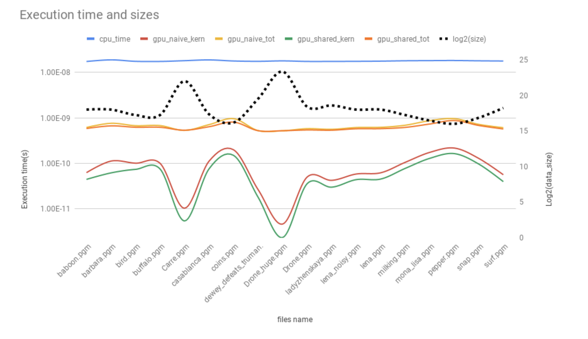
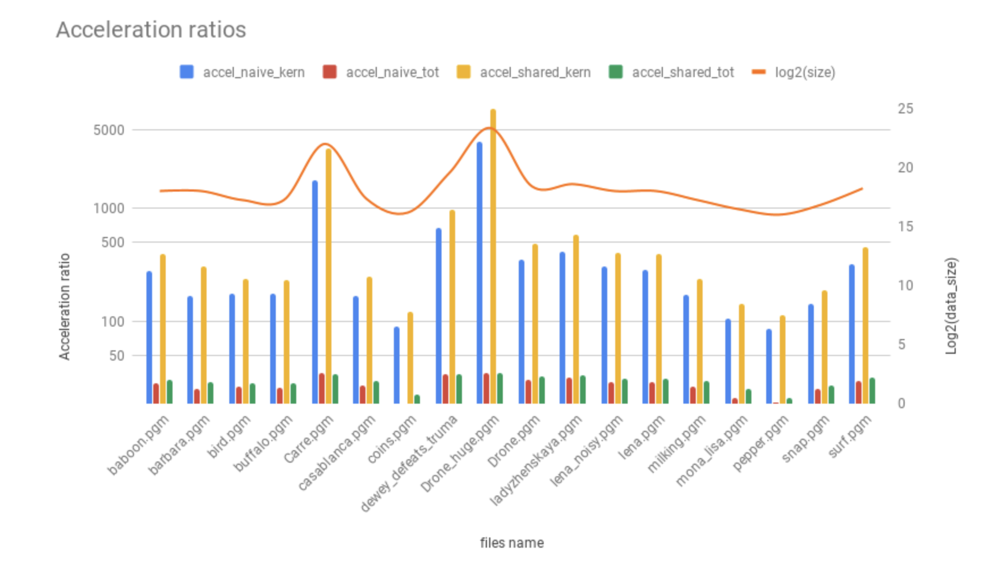
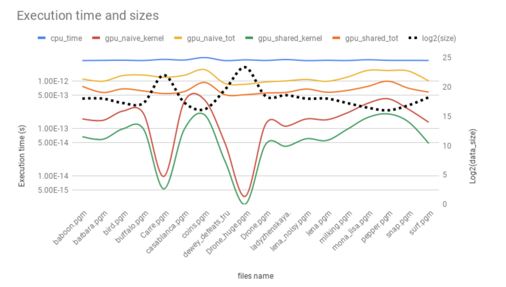

# TP3 Parallel Programming

### Notes

Since I am taking up this late, the numbers and results cannot come from my own experiments. They are thus taken from a friend. The report I am writing, and the codes I wrote with Younes on the date of the TP.

#### Configuration

CPU :

- Intel(R) Core(TM) i7-6700HQ CPU @ 2.60GHz
- 8 Cores

GPU :

- Nvidia Geforce GTX 970M
- 1280 Cuda Cores
- GPU Clock 924MHz + Boost
Memory : 3024MiB GDDR5, 2500 MHz


For this TP, an Nvidia GPU is necessary, as well as a recent GCC compiler version, with the latest OpenMP instructions.
`nvidia-cuda-toolkit`  Linux package is mandatory, in order to get Cuda.

In this TP, we are doing image treatments on GPU with CUDA. To do so, the files need a change of extension, from `.cpp` to `.cu` .
We also need the following headers;
```
#include "cuda_runtime.h"
#include "cuda.h"
#include "device_launch_parameters.h"
```

To invoke CUDA, we need to use a function declared this way:
`__global__ void kernel(args){}`

And here is a list of variables we need to familiarize with:

`__shared__ type variable[size]` : Declaration of an array in GPU shared memory
`blockIdx, blockDim, threadIdx` : Variables letting the kernel have positional informations from the GPU
`atomidAdd(&acc, val)` : Adds `val` to `acc` in a thread safe atomic way
`__syncthreads()` : Function to synchronize the threads of a block.

Each block contains a certain amount of threads, and arguments are passed to the kernel like this:
```
dim3 blocks(args); // ex: block(10,10)
dim3 threads(args2); // threads(32,32)
kernel<<<blocks,threads>>>(args);
```

We need to allocate the GPU memory ourselves. With a `malloc`, `copy`, `operation`, `free` cycle.


## Two Vectors Scalar Product

Here we need to multiply element by element and then sum. In Cuda, we use a thread partial variable and do an `atomicAdd` to compute the total in a thread safe manner


#### Cuda code

```
__global__ void gpu_func(int n, float *x, float *y, float *s)
{
  int i = blockIdx.x*blockDim.x + threadIdx.x;
  if (i < n) atomicAdd(s, x[i] * y[i]);
}
```

```
cudaMalloc(&d_x, N*sizeof(float)); 
cudaMalloc(&d_y, N*sizeof(float));
cudaMalloc(&d_s, sizeof(float));
cudaMemcpy(d_x, x, N*sizeof(float), cudaMemcpyHostToDevice);
cudaMemcpy(d_y, y, N*sizeof(float), cudaMemcpyHostToDevice);
cudaMemcpy(d_s, &s_gpu, sizeof(float), cudaMemcpyHostToDevice);

s_gpu = 0;
cudaMemcpy(d_s, &s_gpu, sizeof(float), cudaMemcpyHostToDevice);
t0 = std::chrono::high_resolution_clock::now();
gpu_func<<<(N+k)/k, k>>>(N, d_x, d_y, d_s);
cudaDeviceSynchronize();
cudaMemcpy(&s_gpu, d_s, sizeof(float), cudaMemcpyDeviceToHost);
```

#### CPU code parallelized on 8 threads

```
void cpu(int n, float *x, float *y, float *s)
{
  omp_set_num_threads(8);
  #pragma omp parallel
  {
      float local_result=0;
      #pragma omp for schedule(static)
      for (unsigned long int i = 0; i < n; i++) {
          local_result += x[i] * y[i];
      }
      #pragma omp critical
          s[0] += local_result;
  }
}
```

#### Performance

As stated earlier, the performance numbers come from a friend.


**legend X-axis: data size, Y-axis: time**
It can be observed that while the total time stays under a max-value, the kernel accelerates exponentially in function of data block size.

Observing the GPU execution profile it can be seen that we are in fact limited by the act of copying data to memory.
I/O Api Calls cudaMemcpy memory accesses are limiting.


## Sobel Filter

#### Cuda code

```
__global__ void gpu_sobel(u_char *Source, int *Resultat, unsigned int height, unsigned int width) {
    int j = blockIdx.x*blockDim.x + threadIdx.x;
    int i = blockIdx.y*blockDim.y + threadIdx.y;
    u_char val;
    int globalIndex = i*width+j;
    if ((i==0)||(i>=height-1)||(j==0)||(j>=width-1)) {Resultat[globalIndex]=0;}
    else {
        val  = std::abs(Source[(i-1)*width+(j-1)] + Source[(i-1)*width+(j)] + Source[(i-1)*width+(j+1)] -\
                       (Source[(i+1)*width+(j-1)] + Source[(i+1)*width+(j)] + Source[(i+1)*width+(j+1)]));
        Resultat[globalIndex]  = val + std::abs(Source[(i-1)*width+(j-1)] + Source[(i)*width+(j-1)] + Source[(i+1)*width+(j-1)] -\
                                             (Source[(i-1)*width+(j+1)] + Source[(i)*width+(j+1)] + Source[(i+1)*width+(j+1)]));

    }
}

__global__ void gpu_sobel_shared(u_char *Source, int *Resultat, unsigned int height, unsigned int width) {
    __shared__ u_char tuile[BLOCKDIM_X][BLOCKDIM_Y];
    
    int x = threadIdx.x;
    int y = threadIdx.y;
    int i = blockIdx.y*(BLOCKDIM_Y-2) + y;
    int j = blockIdx.x*(BLOCKDIM_X-2) + x;
    
    int globalIndex = i*width+j;

    if ((i==0)||(i>=height-1)||(j==0)||(j>=width-1)) {}
    else {            
        //mainstream    
        tuile[x][y] = Source[globalIndex];
        __syncthreads();

        u_char val;
        if ((x>0)&&(y>0)&&(x<BLOCKDIM_X-1)&&(y<BLOCKDIM_Y-1)) {
            val = std::abs(tuile[x-1][y-1] + tuile[x-1][y] + tuile[x-1][y+1] -\
                          (tuile[x+1][y-1] + tuile[x+1][y] + tuile[x+1][y+1]));
            Resultat[globalIndex]  = val + std::abs(tuile[x-1][y-1] + tuile[x][y-1] + tuile[x+1][y-1] -\
                                                   (tuile[x-1][y+1] + tuile[x][y+1] + tuile[x+1][y+1]));
        }
    }  
```

This code was given to us by Mr. Cabaret.

#### Performance



Performances are measured over 1000 iterations and averaged.
Cpu execution time is constant whatever the image size.
Kernel gets much faster with bigger images. But memory accesses are still the bottleneck in this algorithm and represent about 80% of the time spent during the benchmark.



Note that the Axis are in logarithm, which means that accelerations are tremendous.

## Image transposition

#### Cuda code

Here we use the GPU's shared memory to create a table in which we transpose the image, and then we write the result in the final array.
```
__global__ void gpu_transpo_kernel_not_optimal(u_char *Source, u_char *Resultat, unsigned width, unsigned height){
    int j = blockIdx.x*blockDim.x + threadIdx.x;
    int i = blockIdx.y*blockDim.y + threadIdx.y;

    if ((i<0)||(i>=height)||(j<0)||(j>=width)) {}
    else {
        Resultat[j*height + i]  = Source[i*width + j];
    }
}

__global__ void gpu_transpo_kernel_shared(u_char *Source, u_char *Resultat, unsigned width, unsigned height) {
    __shared__ u_char tuile[BLOCKDIM_X][BLOCKDIM_Y+1];
    
    int x = threadIdx.x;
    int y = threadIdx.y;
    int i = blockIdx.y*(BLOCKDIM_Y) + y;
    int j = blockIdx.x*(BLOCKDIM_X) + x;
    

    if ((i<0)||(i>=height)||(j<0)||(j>=width)) {}
    else {            
        tuile[y][x] = Source[i*width + j];
        __syncthreads();
        int i = blockIdx.y*(BLOCKDIM_Y) + x;
        int j = blockIdx.x*(BLOCKDIM_X) + y;
        Resultat[j*height + i] = tuile[x][y];
    }    
}
```
This permits us to use all the threads in a smart way.

### Cpu code

```
void cpu_transpo(u_char **Source, u_char **Resultat, unsigned width, unsigned height){
    #pragma omp parallel for num_threads(8)
    for (unsigned i = 0; i < height; i++) {
        for (unsigned j = 0; j < width; j++) {
            Resultat[j][i]  = Source[i][j];
        }
    }
}
```

All the results show the same bottleneck here.


## Grey Histograms

To make an histogram of grey of an image, we make in each block a partial histogram that is thread safe with the pixels he gets attributed. At the end, we sum the partial histograms.

#### Cuda Code

```
__global__ void gpu_histo_kernel_shared(u_char* Source, int *res, unsigned height, unsigned width){
    __shared__ int hist[256];

    int j = blockIdx.x*blockDim.x + threadIdx.x;
    int i = blockIdx.y*blockDim.y + threadIdx.y;

    int index = threadIdx.x * BLOCKDIM_X + threadIdx.y;

    if( index < 256) {
        hist[index] = 0;
    }
    __syncthreads();


    if ((i<0)||(i>=height) || (j<0) || (j>=width)) {}
    else {
        atomicAdd(&hist[Source[i*width+j]], 1);
        __syncthreads();
        if( index < 256)
            atomicAdd(&res[index], hist[index]);
    }
}
```

#### Cpu code

```
void cpu_histo(u_char** Source, int (*res)[256], unsigned height, unsigned width){
    #pragma omp parallel for num_threads(8)
    for( int i = 0; i < height; i++){
        for( int j = 0; j < width; j++){
            #pragma omp atomic
            (*res)[Source[i][j]]++;
        }
    }
}
```

#### Performance results



Here we observe the same results as we did earlier, with kernel getting faster as the images get bigger.
Memory accesses are still the bottleneck, representing 90% of the time of the benchmark this time.
